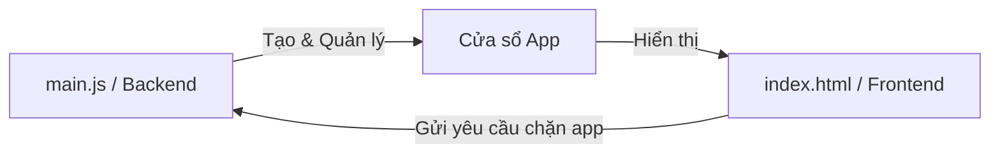

# LockIn Project Structure

Below is the current file tree of the **LockIn** project. This map helps tracking the core components of the application.

```text
LockIn/
├── docs/                      # Documentation and change logs
│   └── project_structure.md   # [YOU ARE HERE] Project file map
├── node_modules/              # Third-party libraries (Electron, etc.)
├── index.html                 # The Visual Interface (HTML, CSS, JS)
├── main.js                    # Electron "Brain" (System window control)
├── package.json               # Project configuration & scripts
└── package-lock.json          # Detailed dependency locking
```

## Frontend vs Backend (Electron Architecture)

Trong thế giới của Electron, chúng ta chia ứng dụng làm 2 "vùng" riêng biệt:

### 1. Frontend (Renderer Process)
*   **Tệp chính:** `index.html`
*   **Vai trò:** Là những gì người dùng **thấy và chạm** vào.
*   **Công nghệ:** HTML (Khung), CSS (Trang trí), JS (Logic giao diện).
*   **Giới hạn:** Nó giống như một trang web, bị "nhốt" trong cửa sổ app nên không thể tự ý tắt các app khác hay can thiệp sâu vào Windows.

### 2. Backend (Main Process)
*   **Tệp chính:** `main.js`
*   **Vai trò:** Là **"Người quản lý"** hệ thống.
*   **Công nghệ:** Node.js (Cho phép app nói chuyện với hệ điều hành).
*   **Quyền hạn:** Nó có quyền tạo cửa sổ mới, quản lý file, và sau này là **chặn các ứng dụng xao nhãng** (System-level blocking).

### Sơ đồ luồng (Flow)

